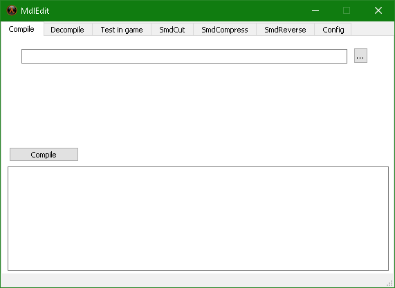
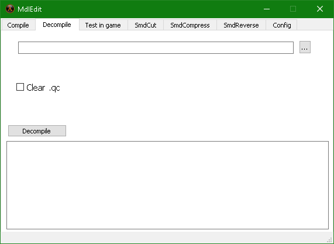
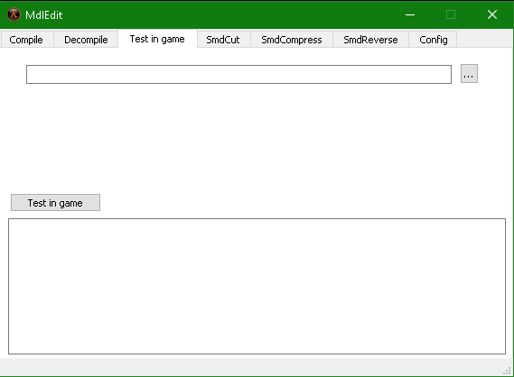
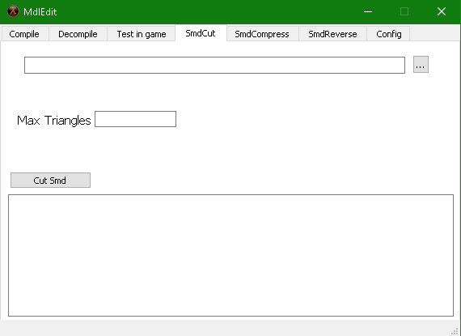
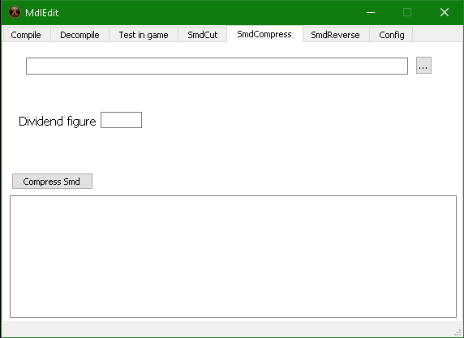
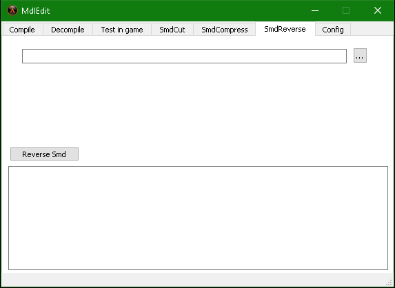
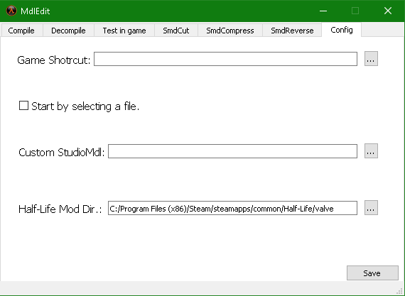

# Mdl-Edit-For-Goldsrc-Verison-1.3
### .mdl and .smd file or model edit tools program for goldsrc(Half-Life 1) verison 1.3

**Author: Virtualzio**

**Used programs:**
Half-Life MDL Decompiler 1.2
2003, Kratisto. Based on code from Valve's HL SDK.

## Images

