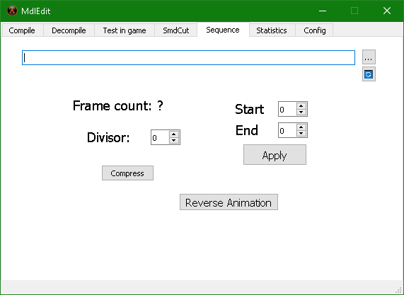

# Mdl-Edit-For-Goldsrc
   

### .mdl and .smd file or model edit tools program for goldsrc game engine.

## Istallation

Download MdlEdit latest relase from [here](https://github.com/sanalzio/Mdl-Edit-For-Goldsrc/releases).

**Author: Virtualzio**

**Used programs:**
Half-Life MDL Decompiler 1.2
2003, Kratisto. Based on code from Valve's HL SDK.

## Images

